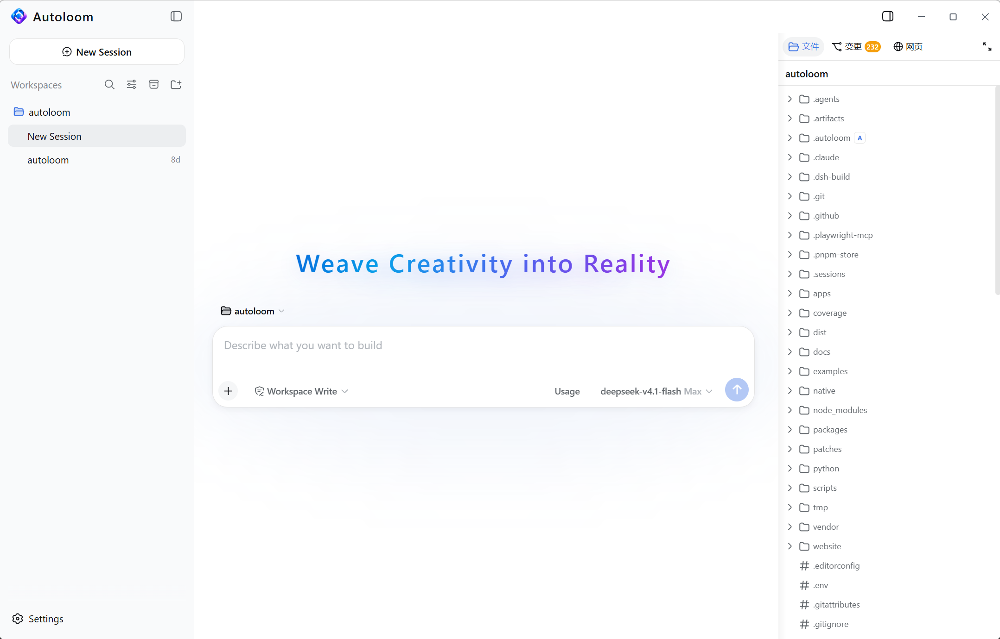
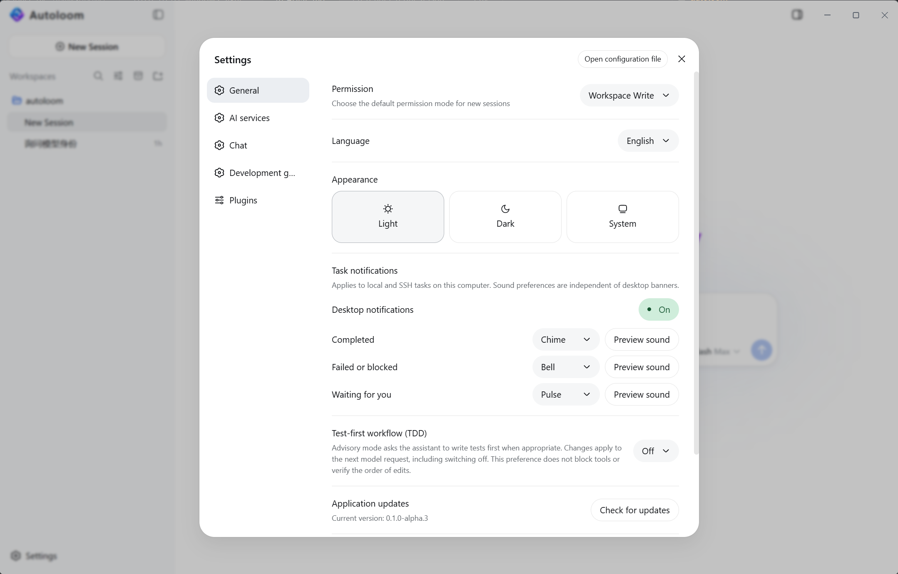

<h1 align="center"> Autoloom</h1>

<strong>Weave Creativity into Reality</strong>

Free desktop client · Your choice of model · Windows x64 Alpha

<a href="https://github.com/GanyuanRan/Autoloom/releases">Download Alpha</a> · <a href="docs/README.md">Documentation</a> · <a href="https://github.com/GanyuanRan/Autoloom/issues">Feedback &amp; ideas</a> · <a href="README.zh-CN.md">中文</a>

<table>
  <tr><th width="50%">Conversation</th><th width="50%">Settings</th></tr>
  <tr>
    <td width="50%" align="center" valign="middle"></td>
    <td width="50%" align="center" valign="middle"></td>
  </tr>
</table>

**AI coding with engineering judgment built into execution.**

Autoloom brings Aegis’s core governance methods into the coding runtime: question whether a change is needed, challenge assumptions before editing, and review delivery against requirements and execution evidence.

Spend less time reminding your agent to investigate first, avoid unnecessary complexity, and show what it actually verified.

## Reasoning at the points where decisions matter

| Method | Its role in the development workflow |
| --- | --- |
| **First principles and change necessity** | At task initiation, examine goals, facts, existing capabilities, and constraints to establish why a change is needed and whether an adequate solution already exists. |
| **Anti-entropy and structural complexity checks** | Before changes, examine duplicated responsibilities, unnecessary layers, and maintenance burden so added complexity addresses a concrete problem. |
| **Counterexample review and causal diagnosis** | Before changes, examine conditions that could invalidate a solution; after execution failures, require diagnosis grounded in observations and evidence. |
| **Implementation conformance and completion review** | Before recording results, compare task requirements, actual execution, and verification material, stating what is complete and what remains unverified. |

Autoloom delivers these method requirements at the relevant points, checks prerequisite ordering for key operations, and retains process records. Whether a method was applied well and a result is reliable still needs to be judged from code, execution results, and verification evidence.

Recorded project goals, constraints, and key decisions stay with the project. Changes to those decisions present a specific diff for your review. You can also configure a test-first preference and code complexity thresholds to reflect your project's requirements.

## From engineering methods to execution

[Aegis](https://github.com/GanyuanRan/Aegis) is our open-source AI engineering method pack. Autoloom integrates its core governance methods into development, covering change necessity, complexity, causal diagnosis, and delivery review.

Guidance loads as needed. The runtime maintains prerequisites for key actions, task state, and execution evidence—connecting governance to actual work and reducing repeated reminders and manual checks. Reliable delivery still depends on actual verification results.

## Built on DeepSeek Harness, with our own approach to development

Autoloom is built on DeepSeek's official open-source **DeepSeek Harness [dsh-v0.1.1-rc.2](https://github.com/deepseek-ai/deepseek-harness/releases/tag/dsh-v0.1.1-rc.2)**, at source commit [`b150a551`](https://github.com/deepseek-ai/deepseek-harness/commit/b150a551b8d465e31e418e1b2eaf5e79bbb7d28e), retaining the Cordis plugin mechanism.

We will continue following official upstream releases and learning from worthwhile improvements. Changes that fit Autoloom and solve real problems will be adopted after adaptation and verification; selected later reliability fixes are already included.

We also maintain our own product direction: bring engineering judgment into automated development, ground the process in evidence, make results inspectable and keep reducing the user's supervision burden. Autoloom has its own version numbers and release cadence.

We thank DeepSeek Harness, Cordis and the related open-source projects for their contributions. The client retains third-party licenses and copyright notices.

## Where we are headed

**Become a trustworthy, fully automated AI software development platform.**

Help ideas progress through requirements, design, implementation, verification, and continued iteration. Make more of that work autonomous while keeping key decisions, supporting evidence, and delivered results inspectable.

That ambition comes with an ongoing question: **how can we achieve the best possible balance of cost, speed, and quality?**

We care about the total cost of reliably delivering a requirement: model calls, waiting time, human supervision, and rework caused by defects. Reducing unproductive attempts and repeated context, and directing verification effort toward what matters to the result, are continuing priorities. Different tasks need different tradeoffs. We aim to improve how much of all three can be achieved together and test those improvements on real tasks.

Autoloom is in Alpha. Fully automated development and a better balance across these three dimensions are goals we are working toward.

**macOS and Linux desktop clients are planned**, so you can use Autoloom on your preferred operating system. Windows x64 is currently available; progress on macOS and Linux will be announced in this repository.

## Follow what comes next

If you want AI development to include this kind of engineering judgment, **[⭐ Star Autoloom](https://github.com/GanyuanRan/Autoloom#top)** to support its continued development. Follow the link to the top of the repository, then click **Star** in the upper-right corner.

For new releases and repository activity, select **Watch → All Activity** at the top right of this repository. You can adjust [notification delivery](https://docs.github.com/en/subscriptions-and-notifications/get-started/configuring-notifications) in GitHub settings. Use Star to bookmark and show support; use Watch to subscribe to notifications.

## Get started

1. Go to [Releases](https://github.com/GanyuanRan/Autoloom/releases) and download the Windows x64 installer, `Autoloom-<version>-win-x64.exe`.
2. Install and open Autoloom. Add your model provider and API key in settings, then select a default model.
3. Open a test project you have backed up and start with a clearly scoped change.

The client is free; your chosen provider bills model usage.

The workspace supports local projects and Linux x64 projects connected over SSH, with project files, code diffs, command logs and previews. Remote environment requirements are listed in the Alpha notes below.

The installed client supports background checks and downloads for Alpha updates. Once a download is ready, click “Restart to update” to install and reopen the client. Finish or stop active tasks first; ordinary exit does not install an update. Users of the older extracted ZIP must install the first installer release manually.

The [user documentation](docs/README.md) covers model providers, permissions, local and SSH projects, Session backup, updates, and troubleshooting.

## Project information

- [Security policy](SECURITY.md) and private vulnerability reporting
- [Data and privacy](DATA_AND_PRIVACY.md)
- [Release history](CHANGELOG.md), generated from GitHub Releases
- [License and use](LICENSE.md)

## Bring a real task and try it

Tell us through [Issues](https://github.com/GanyuanRan/Autoloom/issues) what Autoloom helped you finish, which steps still needed repeated reminders, and where you hesitated to accept its results. Your actual experience will help us choose what is most worth improving next.

When reporting a problem, include the version, system information, reproduction steps, and expected and actual results. Remove keys, access tokens and personal information before sharing logs or screenshots.

This repository is Autoloom's official hub for downloads, release notes and feedback.

Autoloom’s client source code is not currently public. As the project evolves, we’ll evaluate what to open source and how, taking community feedback and sustainable maintenance into account. The current closed-source approach is not a commitment to staying closed source permanently. We’ll share concrete plans in this repository when they’re ready.

Alpha notes and validation scope

- The current release is a Windows x64 test build. Data formats may change during Alpha; back up important projects and task records before upgrading. Incompatible versions will provide manual upgrade instructions.
- SSH remote projects support Linux x64 and require a working SSH connection and Node.js 22.x, version 22.19 or later. Restricted commands also require a working Bubblewrap sandbox backend.
- The installer has no Windows code signature, so Windows may show an unknown-publisher or SmartScreen prompt. Download from this repository's Releases and verify the checksum without disabling system security features.
- Each release provides `SHA256SUMS`. Check the file with PowerShell using `Get-FileHash -Algorithm SHA256 <installer-path>`.
- Consult each Release for its changes and validation scope. Keyless installation, update, or interface checks do not establish that real-model end-to-end tests passed.

