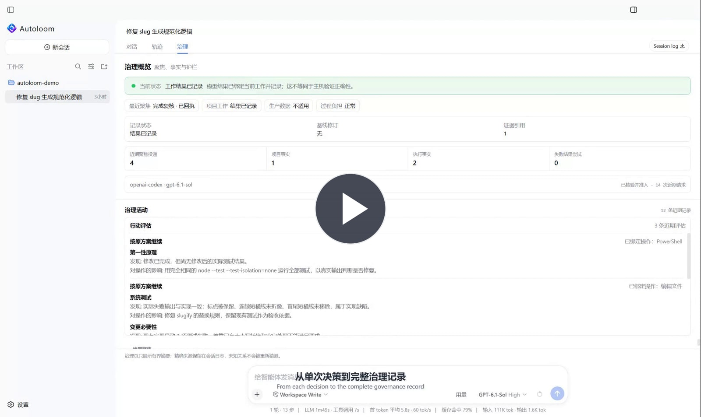
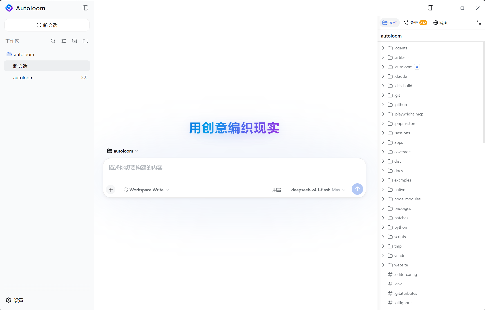
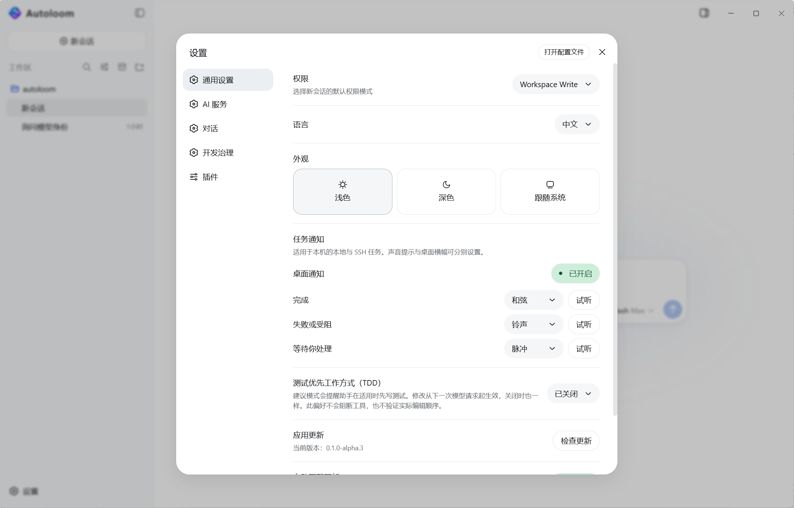
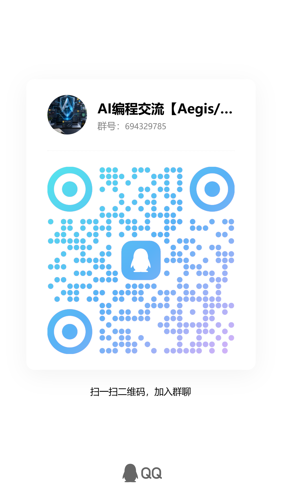

<h1 align="center"> Autoloom</h1>

<strong>面向 Coding Agent 的治理工程</strong>

免费桌面客户端 · 自选模型 · Windows x64 Alpha

<a href="https://autoloom.codes/">官网</a> · <a href="https://github.com/GanyuanRan/Autoloom/releases">下载 Alpha</a> · <a href="docs/README.zh-CN.md">使用文档</a> · <a href="https://github.com/GanyuanRan/Autoloom/issues">反馈与建议</a> · <a href="README.md">English</a>

<a href="https://autoloom.codes/#demo"><strong>观看 40 秒真实任务演示 →</strong></a>

<table>
  <tr><th width="50%">对话界面</th><th width="50%">设置界面</th></tr>
  <tr>
    <td width="50%" align="center" valign="middle"></td>
    <td width="50%" align="center" valign="middle"></td>
  </tr>
</table>

**让工程判断进入 AI 开发的执行过程。**

Autoloom 将 Aegis 的核心治理方法融入开发运行时：先判断改动是否必要，修改前检验关键假设，交付前对照需求与执行证据复核结果。

减少你反复提醒 Agent 先查原因、避免无谓复杂度、说明实际验证结果的负担。

## 把工程思维落到每一次关键判断

| 方法 | 在开发流程中做什么 |
| --- | --- |
| **第一性原理与变更必要性** | 任务开始时，从目标、事实、已有能力与约束出发，判断为什么需要改动，是否已有足够好的解决方式。 |
| **反熵与结构复杂度检查** | 修改前检查重复职责、多余层次和维护负担，让增加的复杂度对应具体问题。 |
| **反证与因果诊断** | 修改前检查方案可能失效的条件；执行失败后，要求依据现象与证据追查原因。 |
| **实施一致性与完成复核** | 结果提交前，对照任务要求、实际执行和验证资料，说明完成了什么、还有什么未经验证。 |

Autoloom 在相应环节投递这些方法要求，并检查关键操作的前置顺序、保留过程记录。方法是否被正确运用、结果是否可靠，仍需通过代码、运行结果与验证证据判断。

项目变更获准执行前，对话中可以折叠展示“治理影响”，说明相关方法怎样改变了这一次具体操作。面向用户的字段跟随请求语言，完整记录仍可随时查看。

已记录的项目目标、约束和关键决定随项目保留；调整这些决定时，会展示具体差异供你审核。你也可以配置测试优先偏好与代码复杂度阈值，让开发过程遵循项目自身的要求。

## 从工程方法到实际执行

[Aegis](https://autoloom.codes/aegis/)（[GitHub](https://github.com/GanyuanRan/Aegis)）是我们维护的开源 AI 工程方法包。Autoloom 将其核心治理方法融入开发流程，覆盖变更必要性、复杂度治理、因果诊断与交付复核。

方法指导按需加载；关键操作的前置检查、任务状态与执行证据由运行时维护，让治理要求与真实执行关联，减少用户反复提醒和核对的负担。交付是否可靠，仍以实际验证结果为依据。

## 从 DeepSeek Harness 出发，持续打磨自己的开发方式

Autoloom 基于 DeepSeek 官方开源项目 **DeepSeek Harness [dsh-v0.1.1-rc.2](https://github.com/deepseek-ai/deepseek-harness/releases/tag/dsh-v0.1.1-rc.2)** 打造，对应源码提交为 [`b150a551`](https://github.com/deepseek-ai/deepseek-harness/commit/b150a551b8d465e31e418e1b2eaf5e79bbb7d28e)，沿用 Cordis 插件机制。

我们会持续关注官方后续版本，借鉴其中值得吸收的优点。适合 Autoloom、能够解决实际问题的改进，会经过适配与验证后纳入产品；目前已吸收部分后续可靠性修复。

同时，我们坚持自己的产品方向：把工程判断放进自动开发，让过程有依据、结果能核对，并持续减少用户的监督负担。Autoloom 使用独立的版本号与发布节奏。

感谢 DeepSeek Harness、Cordis 与相关开源项目的贡献。客户端保留第三方许可证和版权声明。

## 我们要走向哪里

**成为一个可信赖的全自动 AI 软件开发平台。**

让创意从需求、设计走到实现、验证与持续迭代，让更多开发工作能够自主推进，同时让关键决定、过程依据和交付结果清楚可查。

这条路还需要持续回答一个问题：**怎样在成本、速度、质量之间，取得尽可能好的平衡？**

我们关注的是把一项需求可靠交付的总成本：模型调用、等待时间、人工监督，以及缺陷带来的返工。减少无效尝试和重复上下文，把验证投入放在真正影响结果的地方，是我们持续优化的方向。不同任务需要不同取舍；我们会努力扩大三者能够兼顾的空间，并用实际任务检验改进。

Autoloom 目前处于 Alpha 阶段。全自动开发与更好的三者平衡，是我们持续投入的目标。

**后续将支持 macOS 和 Linux 桌面客户端**，让你在习惯的操作系统上使用 Autoloom。目前可下载的是 Windows x64 版本；macOS／Linux 版本的具体进展将通过本仓库公布。

## 关注下一步进展

如果你也期待 AI 开发具备这样的工程判断，欢迎 **[⭐ Star Autoloom](https://github.com/GanyuanRan/Autoloom#top)**，支持我们继续打磨。点击链接回到仓库顶部，再点击右上角的 **Star** 即可。

想持续收到新版本和仓库动态提醒，请点击仓库右上角 **Watch → All Activity（所有动态）**。[通知接收方式](https://docs.github.com/en/subscriptions-and-notifications/get-started/configuring-notifications)可以在 GitHub 设置中调整。Star 用于收藏和表达支持，订阅通知请使用 Watch。

## 开始使用

1. 前往 [Releases](https://github.com/GanyuanRan/Autoloom/releases)，下载 Windows x64 安装包 `Autoloom-<版本>-win-x64.exe`。
2. 安装并打开 Autoloom，在设置中添加自己的模型供应商与 API Key，选择默认模型。
3. 打开一个有备份的测试项目，从一项范围清楚的改动开始。

客户端免费使用，模型费用由你选择的供应商收取。

工作台支持本地项目与 SSH 连接的 Linux x64 项目，提供项目文件、代码差异、命令日志、预览入口和停靠式交互终端。远端环境要求见下方 Alpha 使用说明。

安装版支持后台检查和下载 Alpha 更新。下载完成后点击“重启更新”即可安装并重新打开客户端；活动任务需先完成或停止，普通退出不会安装更新。旧 ZIP 解压版用户需手动安装首个安装版。

[使用文档](docs/README.zh-CN.md)包含模型供应商、权限、本地与 SSH 项目、Session 备份、更新和故障排查说明。

## 项目信息

- [安全策略](SECURITY.zh-CN.md)与私密漏洞报告入口
- [数据与隐私](DATA_AND_PRIVACY.zh-CN.md)
- 从 GitHub Releases 自动生成的[版本历史](CHANGELOG.zh-CN.md)
- [许可与使用条款](LICENSE.md#中文)

## 带一个真实需求来试试

欢迎在 [Issues](https://github.com/GanyuanRan/Autoloom/issues) 告诉我们：Autoloom 帮你完成了什么，哪一步仍需要你反复提醒，哪些地方让你不敢接受结果。你的真实使用经历，会帮助我们判断下一步最值得改进什么。

反馈问题时请附上版本、系统信息、复现步骤及预期和实际结果；分享日志或截图前请移除密钥、访问令牌和个人信息。

本仓库是 Autoloom 的官方下载、版本说明与反馈入口。

Autoloom 客户端源码目前尚未公开。我们会根据项目进展、社区反馈和持续维护的实际情况，评估后续的开源范围与方式。当前的闭源状态并不意味着永久闭源；具体计划确定后，将在本仓库公布。

Alpha 使用说明与验证范围

- 当前发布 Windows x64 测试版。Alpha 阶段数据格式可能变化，升级前请备份重要项目和任务记录；不兼容版本会提供手动升级指引。
- SSH 远端项目支持 Linux x64，需要可用的 SSH 连接及 Node.js 22.x（22.19 或更高）。运行受限命令还需要可用的 Bubblewrap 沙箱后端。
- 当前安装包未进行 Windows 代码签名，可能显示未知发布者或 SmartScreen 提示。请从本仓库 Releases 下载并核对校验和，无需关闭系统安全功能。
- 每个版本提供 `SHA256SUMS`。可用 PowerShell `Get-FileHash -Algorithm SHA256 <安装包路径>` 核对文件。
- 各版本的变更和验证范围以对应 Release 说明为准；无密钥安装、更新或界面检查不等于真实模型端到端测试通过。

中文用户可扫描下方二维码加入 QQ 群交流（群号：`694329785`）。

  

